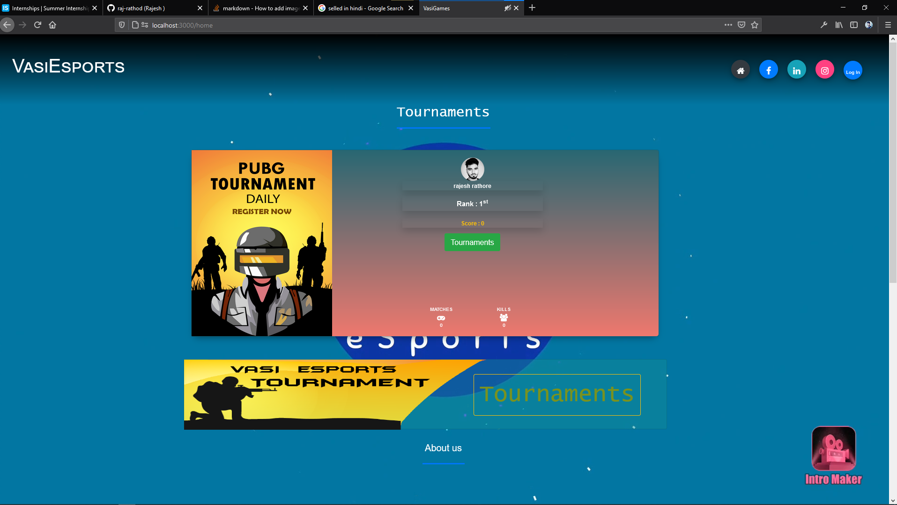
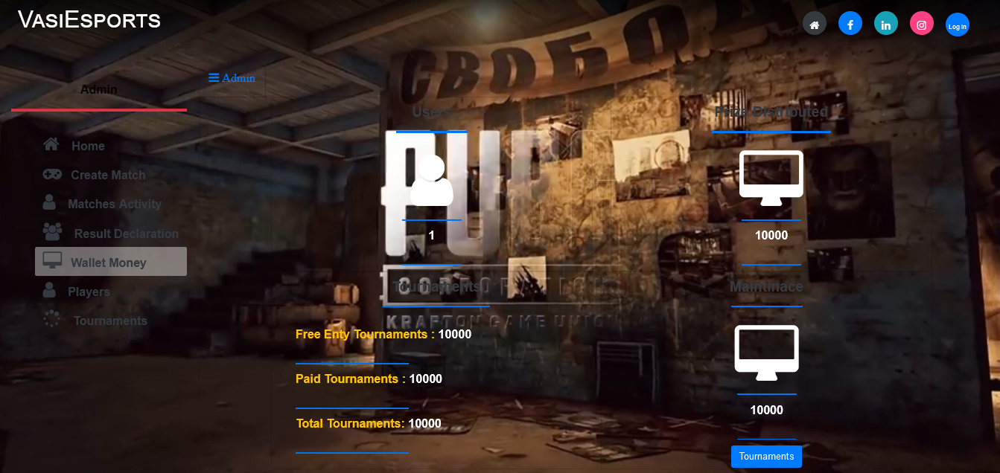
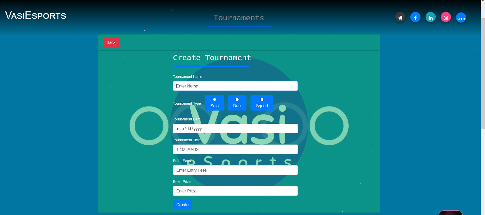
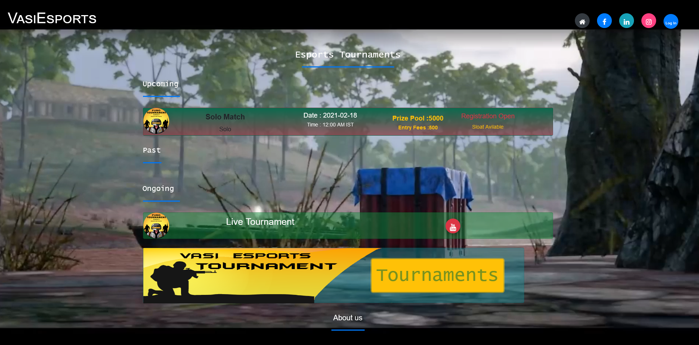
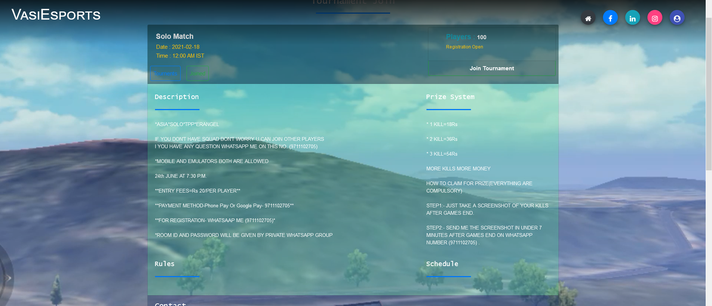
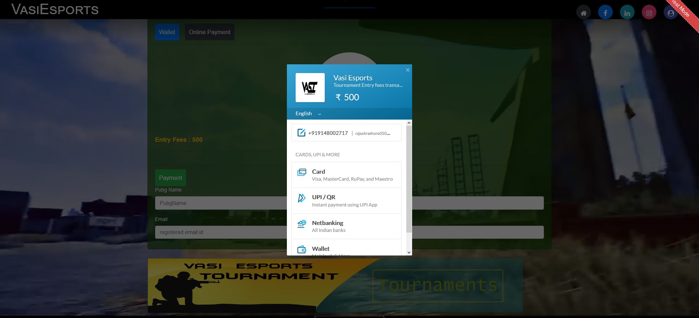
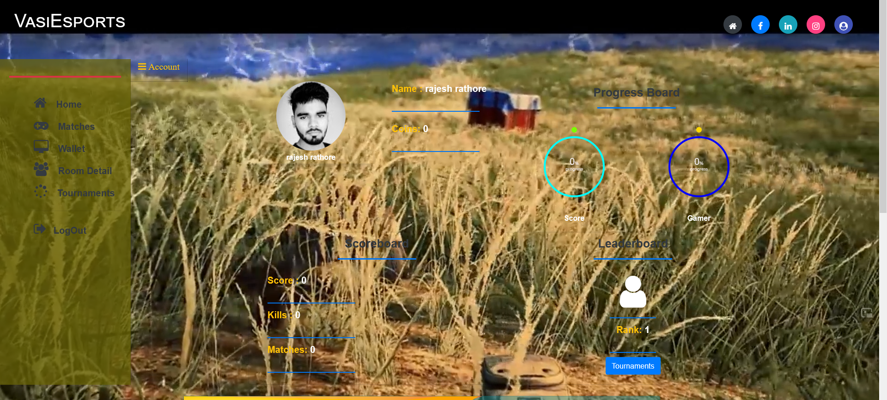
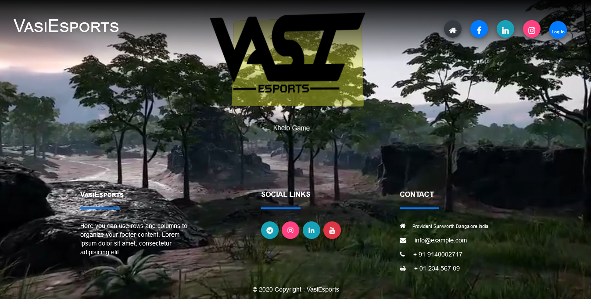

# Esports hosting Platform : 
This project  about hosting an online
esports tournament, where players can register for the upcoming
tournament and get notified when the tournament start. Player will
receive the result as the end of the tournament with the ranking and
the prizes they won.
This project have payment gateway for paying the participation fees
and send a request for withdraw winning prize money and Also players
can use wallet money as a participation fees for next tournament 

     

     

     

     

     

     

     

     

